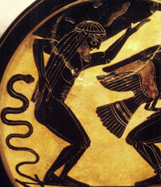

# Atlas
Atlas is aimed to be **lightweight**, **fast** and **generic** interface to Titan.

It is based on RexPro protocol and offers multi-sessions possibilities.

It enables to have typed (and rich) data structures associated with graph elements.

Atlas is different from thunderdome in various ways:
+ much more simple to tweek (no metaclasses)
+ less verbose because elements are defined in a generic way
+ much faster (because thunderdome uses REST)
+ is much closer to the structure of gremlin
- has no save strategies (yet)
- has not yet a proper transactional protocol
- properties should respect a *name_of_variable***_as_***type* syntax
- no auto indices (they have to be defined manually)

# TODO
-check if vertex exists before adding
-implement functions for repetition calls
- clarify the difference between long and integers

